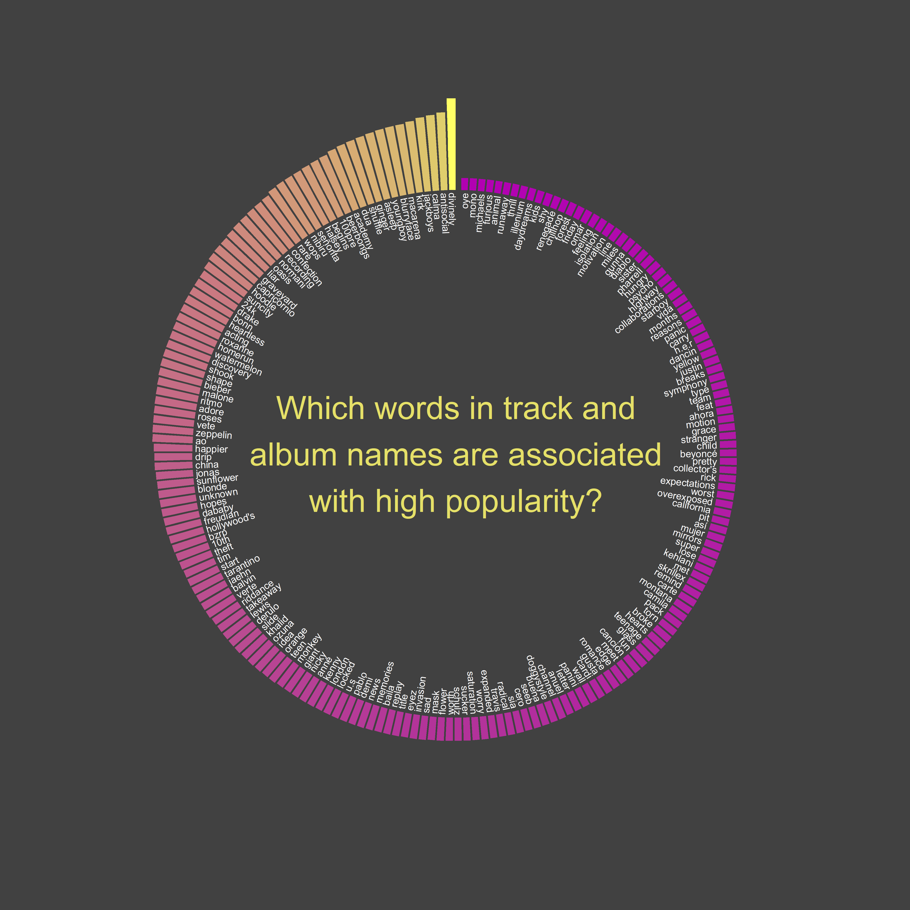
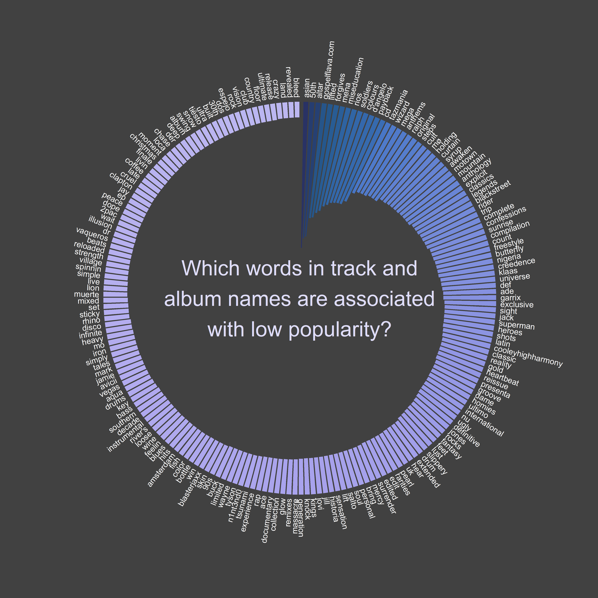

# TidyTuesday 2020-01-21

## Spotify Songs
data: https://github.com/rfordatascience/tidytuesday/tree/master/data/2020/2020-01-21

I tried to run a text mining and sensibility analysis to identify the words from the track and album names that influence track popularity.

