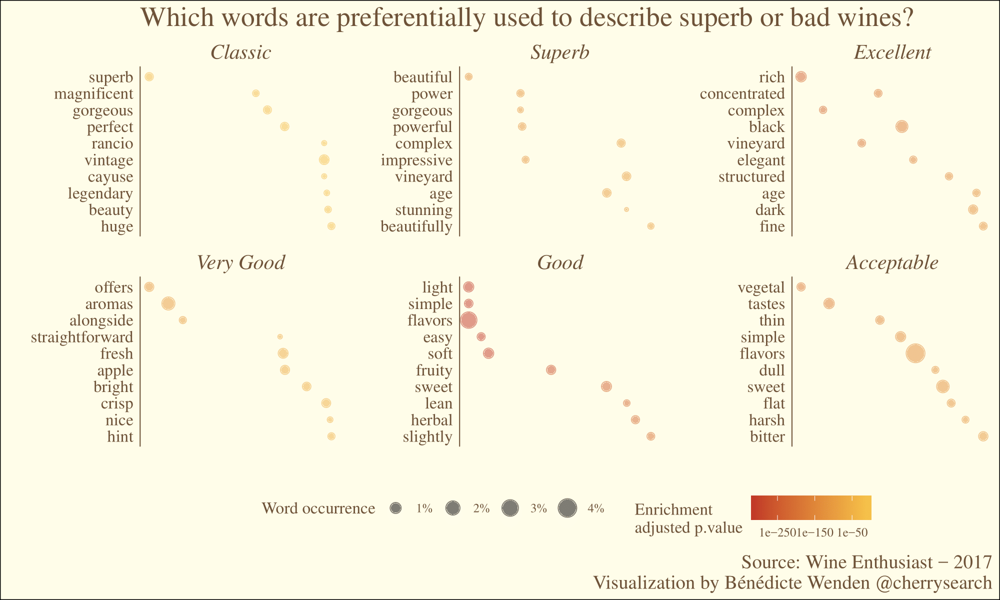

# TidyTuesday 2019-05-28

Wine tasting data from Wine Enthusiast (2017)
data: https://github.com/rfordatascience/tidytuesday/tree/master/data/2019/2019-05-28

I went for an enrichment analysis to identify the words that are over-represented in the different wine scores.

